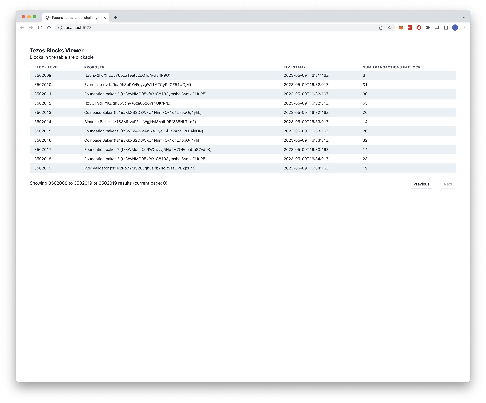
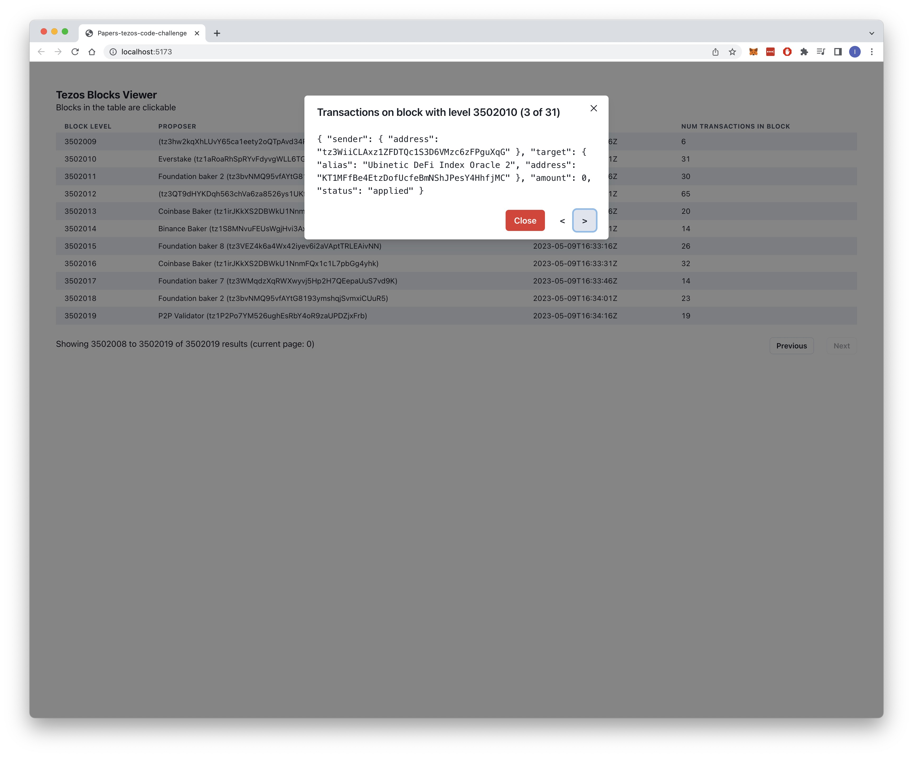

### Explanation
Simple block viewer of Tezos blockchain. It uses https://api.tzkt.io/ API to fetch the blocks in real time. Each level/row in the table is clickable and it displays the transactions contained in that block.



### How to run
Localy can be executed running:
```bash
npm intall
npm run dev
```